# 🧠 Data Ingestion Component - Breakdown & Vibes

This module handles the **data ingestion process** for your ML/DS project. Think of it like the door where raw CSVs enter and get nicely split into training and testing datasets for your model to munch on 😋📊.

---

## 📦 Imports and Dependencies

```python
import os 
import sys
import pandas as pd
from sklearn.model_selection import train_test_split
from dataclasses import dataclass
from src.exception import CustomException
from src.logger import logging
```

### 🔍 What's going on here?

- `os`, `sys`: System-level and path manip stuff.
- `pandas`: For reading and manipulating the CSV file.
- `train_test_split`: For splitting the data into train/test sets.
- `dataclass`: To simplify configuration management.
- `CustomException`: Custom error handling class (defined in your own code).
- `logging`: For logs so you can trace the drama when things go wrong.

---

## 🛠️ Configuration Class

```python
@dataclass
class DataingestionConfig:
    test_data_path: str = os.path.join("artifacts", "test.csv")
    train_data_path: str = os.path.join("artifacts", "train.csv")
    raw_data_path: str = os.path.join("artifacts", "data.csv")
```

### 💡 TL;DR:
- `@dataclass`: Auto-creates an init method, so no need to write boilerplate.
- This config holds the paths to save:
  - Raw data (`data.csv`)
  - Train data (`train.csv`)
  - Test data (`test.csv`)
- All saved in the `artifacts` directory 💾

---

## 🧬 The Main Ingestion Class

```python
class DataIngestion:
    def __init__(self):
        self.ingestion_config = DataingestionConfig()
```

Creates an instance of `DataingestionConfig` so we can access all our predefined paths like `train_data_path`, etc.

---

## 🧪 `initiate_data_ingestion()` Method

Here’s where the ✨ magic ✨ happens!

```python
def initiate_data_ingestion(self):
    logging.info('Entered the Data Ingestion Component')

    try:
        df = pd.read_csv('src/notebook/data/stud.csv')
        logging.info('Reading Dataset as Dataframe')

        os.makedirs(os.path.dirname(self.ingestion_config.test_data_path), exist_ok=True)

        df.to_csv(self.ingestion_config.raw_data_path,index=False, header=True)

        logging.info('Train test split initiated')

        train_set, test_set = train_test_split(df,test_size=0.2,random_state=42)

        train_set.to_csv(self.ingestion_config.train_data_path, index=False, header=True)
        test_set.to_csv(self.ingestion_config.test_data_path, index=False, header=True)

        logging.info('Data Ingestion Complete')

        return (
            self.ingestion_config.test_data_path,
            self.ingestion_config.train_data_path
        )
```

### 🧃 Step-by-step Vibes:

| Step | What it do 💼 |
|------|---------------|
| 1️⃣ | Log entry into method |
| 2️⃣ | Read dataset from `stud.csv` 📥 |
| 3️⃣ | Create folders if they don’t exist 🗂️ |
| 4️⃣ | Save raw copy of the data as `data.csv` |
| 5️⃣ | Split the data into train (80%) & test (20%) |
| 6️⃣ | Save the split files |
| 7️⃣ | Return paths to the saved train/test files 🔁 |

---

## 🚨 Error Handling

```python
except Exception as e:
    raise CustomException(e, sys)
```

If anything flops 💀, it'll raise a `CustomException` (your own class for better debugging).

---

## 🧪 Main Function Execution

```python
if __name__ == "__main__":
    obj = DataIngestion()
    obj.initiate_data_ingestion()
```

### 👀 TL;DR:

- When you run the file directly, this block kicks in.
- It creates an object of `DataIngestion` and calls the ingestion process 🎬

---

## 🧃 Summary Flow

```mermaid
flowchart TD
    A[Start] --> B[Read CSV File]
    B --> C[Save Raw CSV]
    C --> D[Split into Train & Test]
    D --> E[Save Train CSV]
    D --> F[Save Test CSV]
    F --> G[Return Paths]
    G --> H[Done 🎉]
```



---

## 💡 Pro Tips

- Want to change paths? Just tweak `DataingestionConfig`.
- Logging helps you debug without rage quitting 😤
- Splitting data early is a good ML pipeline practice 📊✅

---
